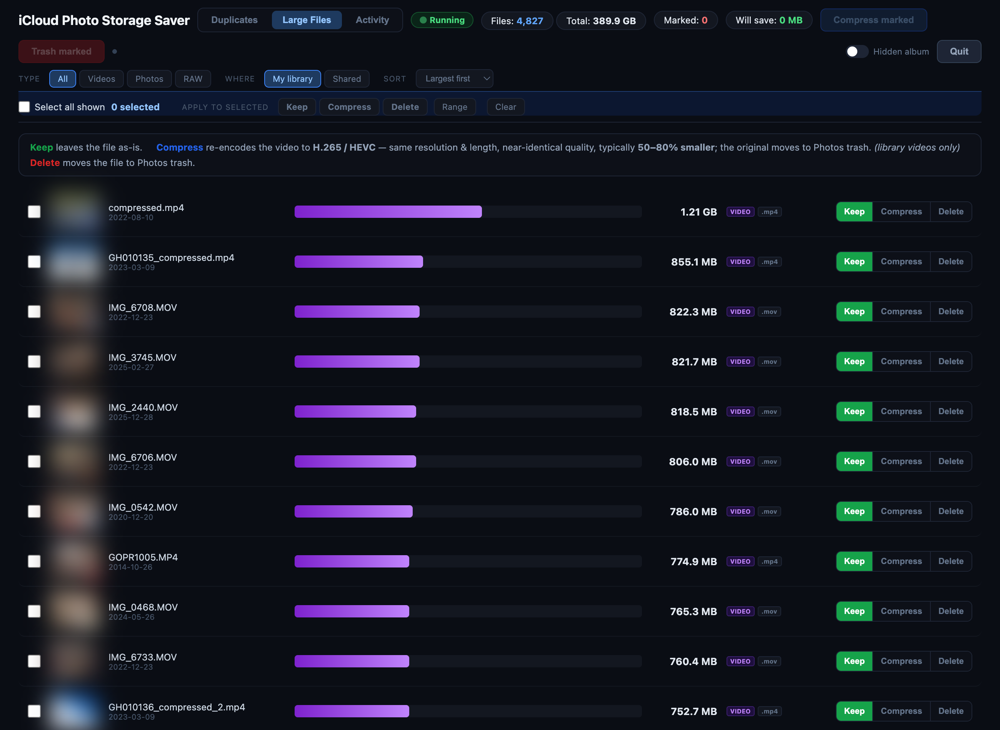
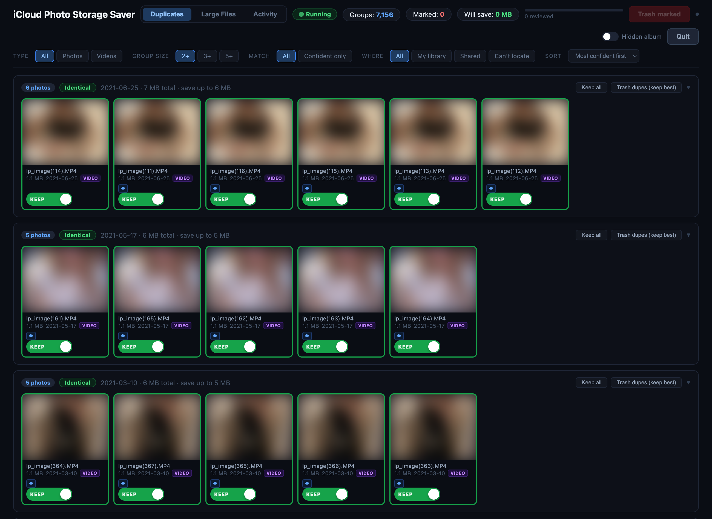
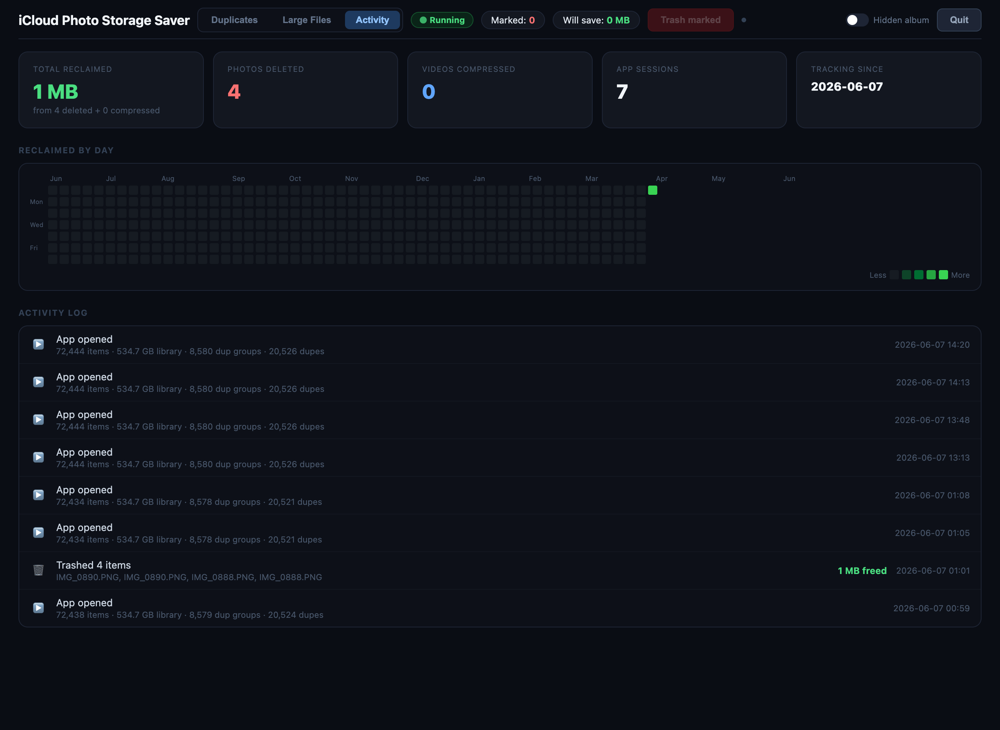

# iCloud Photo Storage Saver

A free, local macOS app to reclaim storage in your **Apple Photos / iCloud** library —
find duplicates, browse and shrink your biggest videos, and track what you've saved over time.

It runs a small web app on your Mac (`http://localhost:8421`) that you use from any browser —
including your **iPhone** over [Tailscale](https://tailscale.com). **Everything runs locally;
no photo or metadata ever leaves your machine.**

> **macOS only.** It reads your Apple Photos library through PhotoKit, so it can't be
> Dockerized or run on Linux — it's a native macOS app you self-host on your own Mac.


*Large Files — every item by size with a visual size bar; Keep / Compress / Delete per row.*


*Duplicates — near-identical groups with a confidence label; keep the best, trash the rest.*


*Activity — total reclaimed, a GitHub-style reclaimed-by-day heatmap, and an audit log.*

<sub>(Thumbnails above are blurred for privacy — the app shows your real photos. Add `#blur`
to the URL anytime to blur thumbnails for screenshots or screen-sharing.)</sub>

> ⚠️ This app moves photos to your Photos **trash** and re-encodes videos. It's careful
> (originals go to the Recently Deleted album, not permanently erased), but you are deleting
> things — review before you empty Photos' trash.

## What it does

- **Duplicates** — perceptual-hash clustering of near-identical photos/videos, with a
  confidence label (identical / near-identical / similar / loose) so you tackle the safe ones
  first. Keep the best of each group, trash the rest.
- **Large Files** — every item sorted by size with a visual size bar. Keep, **Delete**, or
  **Compress** (re-encode videos to H.265/HEVC — typically 50–80% smaller, same resolution).
  Multi-select, batch actions, and a live "Will save" estimate.
- **Activity** — a persistent audit log and dashboard: total space reclaimed, photos deleted,
  videos compressed, and a GitHub-style contribution heatmap of what you cleaned up by day.

Photos are classified by source (your library / shared albums / hidden album / unreachable) so
the app only ever acts on photos you actually own and can delete.

## Install (recommended)

1. Download the latest **`.dmg`** from [Releases](https://github.com/joshtellr/icloud-photo-storage-saver/releases).
2. Open it and drag **iCloud Photo Storage Saver** onto **Applications**.
3. It's not code-signed yet, so the first time: **right-click the app → Open → Open** (once).
4. On first launch it installs its dependencies (a few minutes, shown in Terminal), then asks
   for **Photos access** and **Automation** permission — approve both.
5. It opens `http://localhost:8421`. That's the app.

## Install from source

```bash
git clone https://github.com/joshtellr/icloud-photo-storage-saver.git
cd icloud-photo-storage-saver
bash setup.sh        # installs deps + builds the .app in /Applications
open "/Applications/iCloud Photo Storage Saver.app"
```

Or run it directly without the app bundle:

```bash
~/.local/bin/osxphotos run photo_saver.py      # then open http://localhost:8421
```

## Requirements

- macOS 11+ with the Apple **Photos** app and an active Photos library
- Permissions: **Photos** access + **Automation** (to open items in Photos and trash them)
- Installed automatically by `setup.sh`: [`uv`](https://github.com/astral-sh/uv),
  [`osxphotos`](https://github.com/RhetTbull/osxphotos), `pillow`, `pillow-heif`,
  `pyobjc-framework-Photos`, and (via Homebrew) `ffmpeg` + `exiftool` for the Compress feature.

## Access it from your iPhone (optional)

The app binds to `localhost` only. To reach it from your phone, share it across your private
[Tailscale](https://tailscale.com) tailnet (HTTPS, your devices only — never the public internet):

```bash
# Set an access token first (recommended whenever you expose beyond localhost):
export PHOTO_SAVER_TOKEN="$(openssl rand -hex 16)"; echo "$PHOTO_SAVER_TOKEN"
# launch the app with that env var set, then:
tailscale serve --bg 8421
```

Then open `https://<your-mac>.<your-tailnet>.ts.net/?token=YOUR_TOKEN` on your phone (it sets a
cookie, so later visits don't need the token) and **Add to Home Screen**. Turn the share off
with `tailscale serve --https=443 off`. See [SECURITY.md](SECURITY.md).

## Run it always-on (optional)

Keep it running so your phone can reach it anytime the Mac is on:

```bash
bash install-agent.sh                              # start at login, stay running
PHOTO_SAVER_TOKEN=yourtoken bash install-agent.sh  # …with an access token
bash install-agent.sh --uninstall                  # remove it
```

## Security

- Binds **`127.0.0.1` only** by default — not reachable off your Mac unless you expose it.
- Some endpoints are **destructive** (trash, compress). On loopback they're unauthenticated,
  like any local app.
- **Set `PHOTO_SAVER_TOKEN`** before exposing the port anywhere. With it set, every request
  needs the token (`?token=`, `X-Auth-Token` header, or the `ps_token` cookie) or gets `401`.
- Prefer a private network (Tailscale) over public exposure. Full details in
  [SECURITY.md](SECURITY.md).

## Privacy

100% local. No analytics, no telemetry, and **no external network calls at runtime** — only the
dependency installer (first run) and, if *you* enable it, Tailscale touch the network. The audit
log, hash cache, and your keep/trash choices are plain files in your home folder
(`~/.photos_dedup_*`, `~/.photo_saver_audit.jsonl`).

## How it works

- [**osxphotos**](https://github.com/RhetTbull/osxphotos) reads your Photos library database and
  the local thumbnail derivatives — no iCloud downloads needed for analysis.
- **Duplicates** are found by perceptual hashing (a 64-bit dHash per thumbnail) clustered with
  union-find over exact matches plus near-matches within a time window. A per-cluster "tightness"
  score yields the identical / near-identical / similar / loose confidence label.
- **PhotoKit** (via PyObjC) classifies each photo's source and performs deletions (to the Photos
  trash). Photos not in your own library are read-only.
- **Compression** exports the original, re-encodes with `ffmpeg` to H.265 (copying metadata with
  `exiftool`), re-imports the smaller copy, and trashes the original.
- The UI is a single dependency-free HTML/JS page served by a stdlib `ThreadingHTTPServer`;
  thumbnails are resized + LRU-cached in memory.

## Contributing / releases

Issues and PRs welcome. Cut a release by running `bash build_dmg.sh` and attaching
`dist/iCloudPhotoStorageSaver.dmg` to a GitHub Release.

A signed + notarized build (so the app opens without the right-click step) needs an Apple
Developer ID — that's a planned future improvement.

## License

[GPL-3.0](LICENSE) © contributors. Forks and derivatives must stay open source under the GPL.
